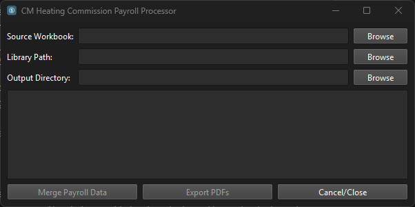
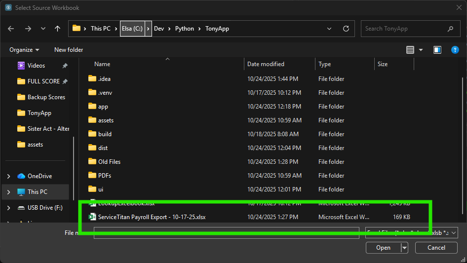
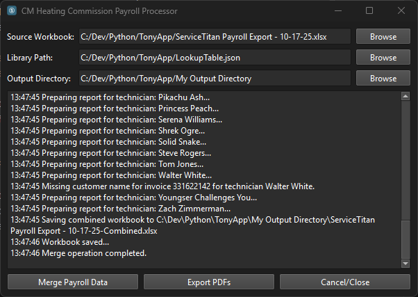

# CM Heating Payroll Processor

This project is a tool that allows the user to perform the following tasks:
1. Merge ServiceTitan automated commission payments in with manual commission adjustments.
2. Generate a master workbook that includes all commission payments for payroll processing and individual named commission reports on a per-tech basis.
3. Cross-reference historical invoice data to fill in missing customer names in the commission data.
4. Export PDFs of the individual commission reports from the data generated by the above merge and lookups with the intent of distributing to individual technicians for review.

## Usage & Operation

1. Locate the `Payroll Processor.exe` file in the file explorer and double-click to launch the application.


2. Upon launching, the user will be presented with the main interface of the application.



3. Click the "Browse" button next to the `Source Workbook` input field to select the source workbook file for this pay period. The source workbook should contain the commission data exported from ServiceTitan as well as any manual adjustments (DPAs).




4. Similarly, click the "Browse" button next to the `Library Path` input field to select the historical invoice data file. This file is used to look up missing customer names in the commission data.


__NOTE:__ The Library Data can be either an Excel workbook exported from ServiceTitan or the generated historical invoice JSON lookup file. The generated JSON file is preferred for performance reasons and should appear after using the application for the first time.

5. Lastly, click the "Browse" button next to the `Output Directory` input field to select the folder where the generated reports, master workbook, and PDF exports will be saved.


6. Once all input fields are populated, click the newly activated "`Merge Payroll Data`" button at the bottom left of the window to start the processing operation.


7. The application will process the data and generate the required report workbook. The central log window will display progress updates during the operation.



8. Upon completion, the logging pane will indicate that the operation was successful.

9. At this point, the user is encouraged to review the generated master workbook and individual commission reports for accuracy. The files will be located in the output directory specified earlier.

__NOTE:__ DO NOT CLOSE THE PAYROLL PROCESSOR APPLICATION AT THIS TIME, IT WILL LOSE ITS CONNECTION TO THE MERGED WORKBOOK AND WILL BE UNABLE TO EXPORT THE PDF REPORTS.

10. After reviewing the generated reports, click the now-active "`Export PDFs`" button at the bottom center of the window to generate PDF versions of the individual commission reports for distribution to technicians. The application will ask for the date to append to the PDF filenames.


11. The application will export the individual commission reports as PDFs and save them in the output directory specified earlier. Progress will be displayed in the logging pane.


12. Once the PDF export operation is complete, the logging pane will indicate that the operation was successful. The user may now close the application and distribute the generated PDF reports to the respective technicians for their review.

## Dependencies
The CM Heading Payroll Processor relies on the following libraries and frameworks:
- `openpyxl` - For reading and writing Excel workbooks.
- `PySide6` - For creating the graphical user interface (GUI).
- `pywin32` - For interacting with Microsoft Excel via COM automation.
- `pyinstaller` - For packaging the application into a standalone executable.

## System Requirements:
- **OS:** Windows 10 or later
- **Microsoft Excel:** Version 2016 or later
- **Disk Space:** Minimum 50 MB free space for application and temporary files
- **Permissions:** Read and write permissions for the directories containing the source workbook, library data, and output directory.

## Exporting the Executable
To export the application as a standalone executable, use the following `pyinstaller` command in this application's virtual environment terminal:

```bash
pyinstaller --clean -y --onefile --noconsole --icon=assets/app.ico main.py
```

If the packaging fails, ensure that all dependencies are installed in the virtual environment and that the `pyinstaller` command is executed from within that environment.